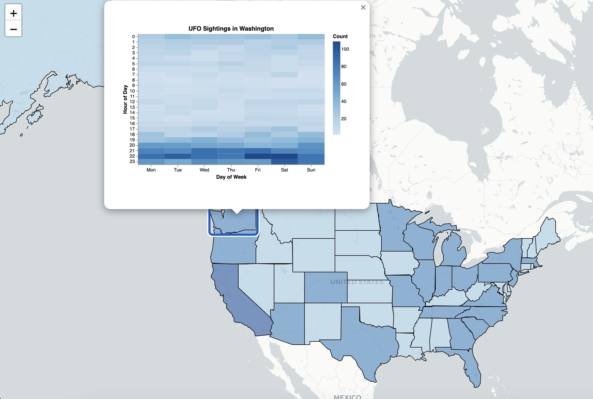
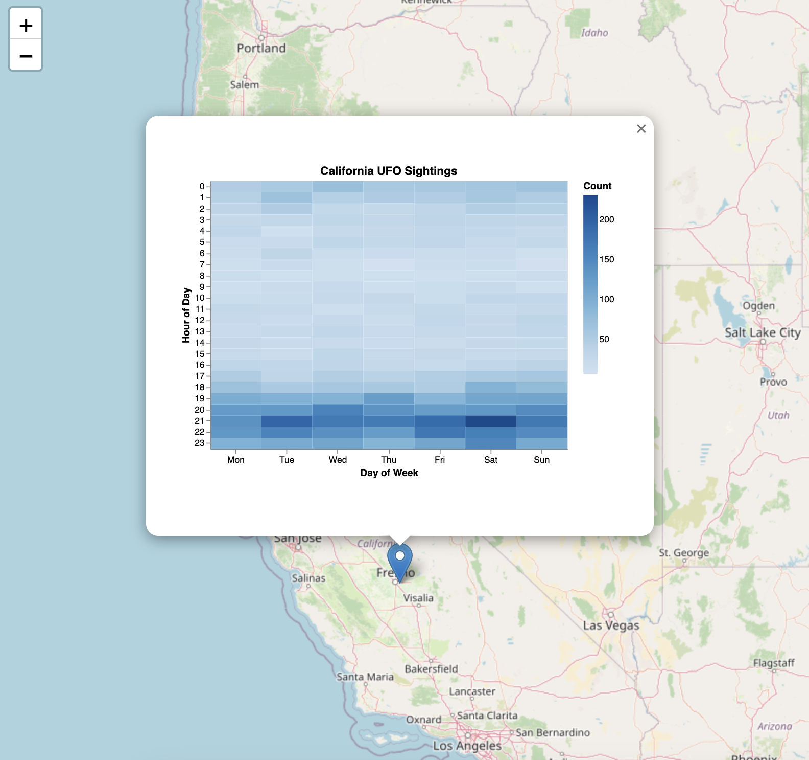

# Folium Integration

The `latent-calendar` library provides seamless integration with [Folium](https://python-visualization.github.io/folium/) to display interactive calendar heatmaps as map popups. This is perfect for visualizing temporal patterns across geographic locations.

## Installation

To use the Folium integration, install the library with the optional dependencies:

```bash
pip install latent-calendar[html,folium]
```

This installs:

- `altair>=5.0.0` - For generating interactive HTML calendar charts
- `folium>=0.14.0` - For creating interactive maps

## Quick Start

Here's a minimal example showing UFO sightings in California:

```python
import folium
from latent_calendar.datasets import load_ufo_sightings
from latent_calendar.integrations.folium import create_calendar_popup

# 1. Load and aggregate data by state
df = load_ufo_sightings()
df_states = df[df['country'] == 'us'].cal.aggregate_events(
    by='state/province',
    timestamp_col='Date_time'
)

# 2. Get California's weekly pattern (168 values)
california_data = df_states.loc['ca']

# 3. Create an interactive popup
popup = create_calendar_popup(
    california_data,
    title="California UFO Sightings",
    width=400,
    height=280,
    color_scheme='blues'
)

# 4. Add to map
m = folium.Map(location=[36.7, -119.7], zoom_start=6)
folium.Marker(
    location=[36.7, -119.7],
    popup=popup,
    tooltip="Click to see calendar"
).add_to(m)

m.save('california_ufos.html')
```

## Understanding the Data Format

The Folium integration works with the **wide format** produced by `.cal.aggregate_events()`:

- **Input**: A Series or DataFrame row with 168 values (7 days × 24 hours)
- **Calendar columns**: Multi-index with `(day_of_week, hour)` pairs
- **Values**: Event counts or any numeric data for each time slot

Example:
```python
>>> df_states.loc['ca']
day_of_week  hour
0            0       45
             1       32
             ...
6            23      67
Name: ca, dtype: int64
```

## API Overview

The integration provides four main functions:

- **`create_calendar_popup()`** - Creates interactive popups (most common)
- **`create_calendar_tooltip()`** - Creates compact hover tooltips
- **`create_popup_html()`** - Generates HTML strings (advanced)
- **`create_tooltip_html()`** - Generates tooltip HTML (advanced)

For complete API documentation with all parameters and options, see the [Folium Integration API Reference](../modules/integrations/folium.md).

## Complete Example: UFO Sightings Map

This example shows the recommended workflow - aggregating UFO sightings by state and displaying them on an interactive map with calendar popups. The complete code is available in `examples/folium_ufo_sightings.py`.

**Requirements:**
```bash
pip install latent-calendar[html,folium] requests us
```

**Complete code:**

```python
"""Interactive map showing weekly UFO sighting patterns by state."""
import folium
import requests
import us  # For state name/abbreviation mapping
from latent_calendar.datasets import load_ufo_sightings
from latent_calendar.integrations.folium import create_calendar_popup

# 1. Load and aggregate UFO sightings by state
print("Loading UFO sightings data...")
df = load_ufo_sightings()

# Filter to US sightings and clean state codes
df_us = df[df['country'] == 'us'].copy()
df_us['state/province'] = df_us['state/province'].str.lower().str.strip()

# Aggregate to weekly calendar format (7 days × 24 hours = 168 time slots)
df_states = df_us.cal.aggregate_events(
    by='state/province',
    timestamp_col='Date_time'
)
print(f"Aggregated data for {len(df_states)} states")

# Calculate total sightings per state for choropleth coloring
state_totals = df_states.sum(axis=1).to_dict()

# 2. Load US states GeoJSON
print("Fetching US states GeoJSON...")
geojson_url = 'https://raw.githubusercontent.com/python-visualization/folium-example-data/main/us_states.json'
geo_data = requests.get(geojson_url).json()

# 3. Create map centered on US
m = folium.Map(location=[37.8, -96], zoom_start=4, tiles='cartodbpositron')

# 4. Add calendar popup to each state polygon
print("Adding state popups...")
for feature in geo_data['features']:
    state_name = feature['properties']['name']

    # Convert state name to abbreviation
    state_obj = us.states.lookup(state_name)

    if state_obj:
        state_abbr = state_obj.abbr.lower()

        if state_abbr in df_states.index:
            # State has data - create calendar popup
            calendar_data = df_states.loc[state_abbr]
            total = int(state_totals[state_abbr])

            popup = create_calendar_popup(
                calendar_data,
                title=f"UFO Sightings in {state_name}",
                width=400,
                height=280,
                color_scheme='blues',
                show_values=False  # Faster rendering
            )

            # Color by total sightings
            if total > 5000:
                fill_color = '#08519c'  # Dark blue
            elif total > 1000:
                fill_color = '#3182bd'
            else:
                fill_color = '#9ecae1'  # Light blue

            folium.GeoJson(
                feature,
                style_function=lambda x, color=fill_color: {
                    'fillColor': color,
                    'fillOpacity': 0.6,
                    'color': 'black',
                    'weight': 1
                },
                popup=popup,
                tooltip=state_name
            ).add_to(m)

# 5. Save map
m.save('ufo_sightings_map.html')
```

**What this creates:**

- Click any state to see its weekly UFO sighting pattern
- States are colored by total sightings (darker = more sightings)
- Calendar heatmap shows day-of-week vs hour-of-day patterns
- Hover to see state names


*Example: Clicking on Washington shows evening spikes in UFO sightings (8-11 PM)*

**Customization tips:**

- Change `color_scheme='blues'` to `'viridis'`, `'greens'`, etc.
- Set `show_values=True` to display counts in calendar cells
- Adjust `width` and `height` for different popup sizes
- Use `monday_start=False` for Sunday-first weeks

### Simple Marker Example

For a quick test with a single location:

```python
import folium
from latent_calendar.datasets import load_ufo_sightings
from latent_calendar.integrations.folium import create_calendar_popup

# Aggregate by state
df = load_ufo_sightings()
df_states = df[df['country'] == 'us'].cal.aggregate_events(
    by='state/province',
    timestamp_col='Date_time'
)

# Create popup for California
popup = create_calendar_popup(
    df_states.loc['ca'],
    title="California UFO Sightings",
    color_scheme='blues'
)

# Add to map
m = folium.Map(location=[36.7, -119.7], zoom_start=6)
folium.Marker([36.7, -119.7], popup=popup).add_to(m)
m.save('california_map.html')
```


*Simple marker showing California's UFO sighting pattern - notice the evening peak on Saturday nights*

## Performance Optimization

For maps with many popups, consider these optimizations:

### 1. Reduce Chart Dimensions
```python
popup = create_calendar_popup(
    data,
    width=350,   # Smaller than default 500
    height=250   # Smaller than default 350
)
```

### 2. Hide Cell Values
```python
popup = create_calendar_popup(
    data,
    show_values=False  # Removes text labels from cells
)
```

### 3. Disable Interactivity (if not needed)
```python
popup = create_calendar_popup(
    data,
    interactive=False  # Removes zoom/pan controls
)
```

**Example Results:**
- 50 US states with full interactivity: ~880 KB
- 50 states with `show_values=False`: ~870 KB
- 50 states with smaller dimensions: ~750 KB

## Use Cases

### 1. Geographic Time-Series Analysis
Visualize how temporal patterns vary across locations (e.g., crime patterns by neighborhood, sales patterns by store location).

### 2. Event Distribution Maps
Show when and where events occur throughout the week (e.g., taxi pickups, bike rentals, restaurant reservations).

### 3. Operational Analytics
Display operational patterns for facilities or regions (e.g., call center activity, manufacturing output, customer service requests).

### 4. Research Visualization
Present research findings with interactive geographic context (e.g., social media activity, environmental sensors, mobile app usage).

## Advanced Customization

### Custom Color Schemes

Use any Altair/Vega color scheme:
```python
# Sequential schemes
color_scheme='blues', 'greens', 'reds', 'purples', 'greys', 'oranges'

# Perceptual schemes
color_scheme='viridis', 'plasma', 'inferno', 'magma', 'cividis'

# Diverging schemes
color_scheme='redblue', 'redgrey', 'blueorange'
```

### Sunday Week Start
```python
popup = create_calendar_popup(
    data,
    monday_start=False  # Week starts on Sunday
)
```

### Multiple Popups on Same Map
```python
for location, data in zip(locations, datasets):
    popup = create_calendar_popup(data, title=location)
    folium.Marker(location, popup=popup).add_to(map)
```

## Technical Details

### How It Works

The integration uses three key technologies:

1. **Altair**: Generates interactive Vega-Lite charts as standalone HTML documents
2. **Folium IFrame**: Embeds HTML documents using base64 encoding
3. **Calendar Grid**: Transforms 168-value wide format into 7×24 heatmap

**Data Flow:**
```
User Data → .cal.aggregate_events() → 168 columns
→ wide_to_long_format() → Altair Chart → HTML Document
→ folium.IFrame → folium.Popup
```

### The IFrame Solution

The implementation uses `folium.IFrame` to properly embed full HTML documents:

```python
iframe = folium.IFrame(html, width=max_width, height=height+80)
popup = folium.Popup(iframe, max_width=max_width)
```

This creates proper isolation between the map's HTML and the chart's HTML, preventing rendering issues in browsers.

## Troubleshooting

### Issue: Raw JavaScript visible in popup
**Cause:** Old implementation passed HTML directly to `folium.Popup()`
**Solution:** Update to latest version that uses `folium.IFrame`

### Issue: Chart not displaying
**Cause:** Missing optional dependencies
**Solution:** `pip install latent-calendar[html,folium]`

### Issue: Calendar has wrong dimensions
**Cause:** Data not in 168-column format
**Solution:** Ensure data comes from `.cal.aggregate_events()` with default parameters

### Issue: Popup too small
**Cause:** Default `max_width` is too small
**Solution:** Increase `max_width` parameter:
```python
popup = create_calendar_popup(data, max_width=800)
```

## See Also

- [Folium Integration API Reference](../modules/integrations/folium.md) - Complete API documentation
- [HTML Module Reference](../modules/html.md) - Low-level HTML generation functions
- [`.cal` Accessor](./cal-attribute.md) - Core API for data aggregation
- [UFO Sightings Dataset](./datasets/ufo-sightings.md) - Example dataset used in examples
- [Folium Documentation](https://python-visualization.github.io/folium/) - Official Folium docs
- [Altair Color Schemes](https://vega.github.io/vega/docs/schemes/) - Available color palettes
