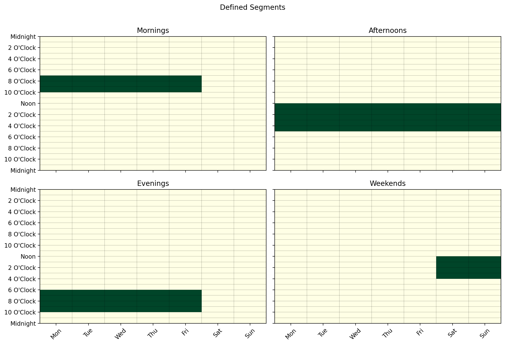
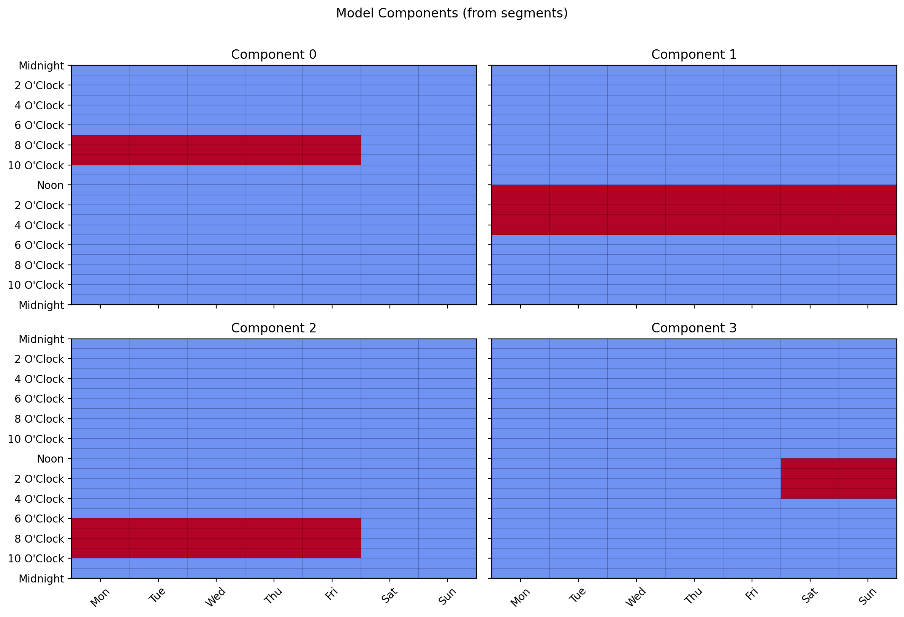
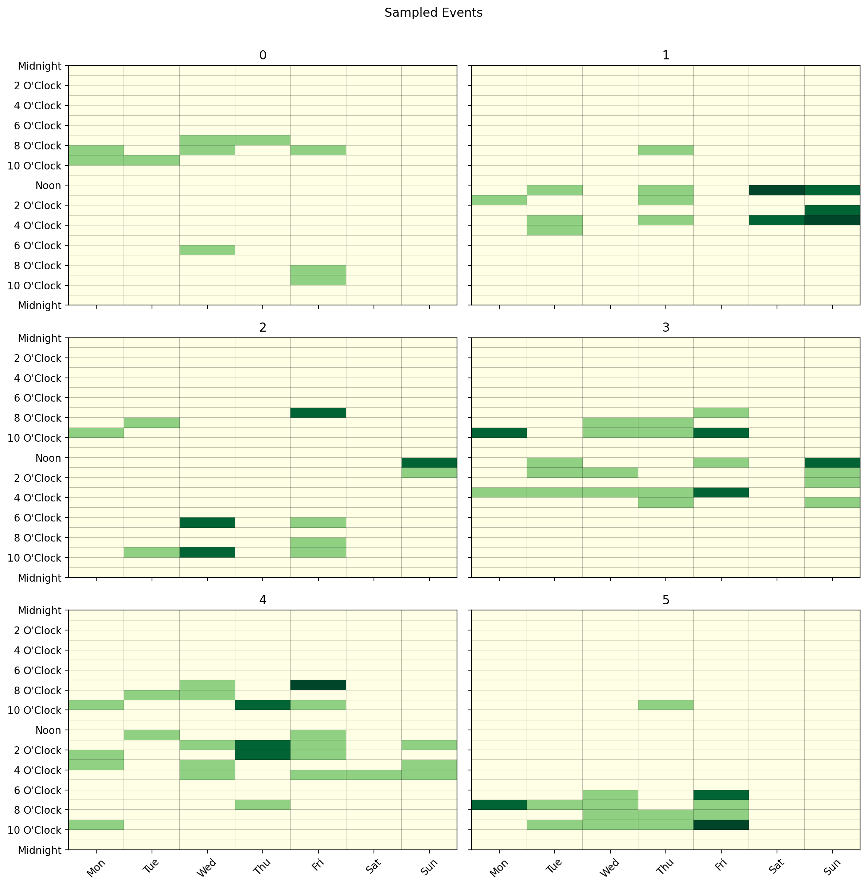
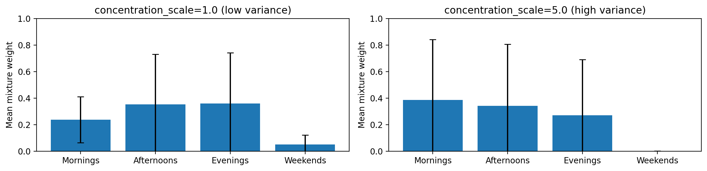

# Generation Process

The `LatentCalendar` model is a generative model — after fitting, it can be used to
produce synthetic calendar data that reflects the patterns it discovered. This is useful
for simulation, testing, and understanding what the model has learned.

## Fitting a Model

Start with some calendar data in wide format and fit the model:

```python
from latent_calendar.generate import wide_format_dataframe
from latent_calendar import LatentCalendar

df = wide_format_dataframe(n_rows=50, rate=2.0, random_state=0)

model = LatentCalendar(n_components=5, random_state=0)
model.fit(df)
```

## Creating a Sampler

Once the model is fitted, create a sampler from it:

```python
sampler = model.create_sampler(random_state=42)
```

The sampler draws component mixture weights from the population-level Dirichlet prior
learned during fitting, then samples events from those weights.

## Sampling a Single User

Use `sample_events(n)` to generate `n` events for a single user:

```python
df_weights, df_events = sampler.sample_events(n=10)

# df_weights: (1, n_components) — the user's mixture over patterns
# df_events:  (1, 168)          — event counts across the weekly time slots
print(df_events.sum(axis=1))  # sums to 10
```

## Sampling Multiple Users

Pass a list to `sample()` to generate events for multiple users at once,
where each element is the number of events for that user:

```python
df_weights, df_events = sampler.sample(n_samples=[10, 5, 20])

# df_weights: (3, n_components)
# df_events:  (3, 168)
print(df_events.sum(axis=1))  # [10, 5, 20]
```

## Convenience Function

A convenience function is available if you don't need to reuse the sampler:

```python
from latent_calendar.generate import sample_from_latent_calendar

df_weights, df_events = sample_from_latent_calendar(
    model, n_samples=[10, 5, 20], random_state=42
)
```

## Summarizing by Segment

The returned event count DataFrame is in the same wide format as training data,
so it works directly with the segments API to summarize activity by time window:

```python
from latent_calendar.segments import create_box_segment, stack_segments

mornings = create_box_segment(
    day_start=0, day_end=7, hour_start=6, hour_end=11, name="Mornings"
)
evenings = create_box_segment(
    day_start=0, day_end=7, hour_start=17, hour_end=22, name="Evenings"
)
df_segments = stack_segments([mornings, evenings])

# Count how many events each user had in each segment
df_events.cal.sum_over_segments(df_segments)
```

## Sampling Without Real Data (Mock Model)

You can generate synthetic data without fitting on a real dataset by constructing
a model from a hand-crafted prior. `DummyModel.from_prior` accepts either a numpy
array or a segment Series directly — so you can describe a pattern using the segments
API and feed it straight into the model:

```python
from latent_calendar import DummyModel
from latent_calendar.segments import create_box_segment

mornings = create_box_segment(
    day_start=0, day_end=5, hour_start=7, hour_end=10, name="Weekday mornings"
)

model = DummyModel.from_prior(mornings)
sampler = model.create_sampler(random_state=0)

df_weights, df_events = sampler.sample(n_samples=[20, 30, 15])
```

## Sampling from Multiple Segments

Use `DummyModel.from_segments` to build a multi-component model where each segment
is one component. The sampler then draws a mixture over those segments per user —
`df_weights` tells you how much each user's events came from each segment:

```python
from latent_calendar import DummyModel
from latent_calendar.segments import create_box_segment, stack_segments

mornings = create_box_segment(
    day_start=0, day_end=5, hour_start=7, hour_end=10, name="Mornings"
)
evenings = create_box_segment(
    day_start=0, day_end=5, hour_start=18, hour_end=22, name="Evenings"
)
afternoons = create_box_segment(
    day_start=0, day_end=7, hour_start=12, hour_end=17, name="Afternoons"
)
weekends = create_box_segment(
    day_start=5, day_end=7, hour_start=12, hour_end=16, name="Weekends"
)
df_segments = stack_segments([mornings, afternoons, evenings, weekends])
df_segments.cal.plot_by_row(max_cols=2)
```



Each row is one component. Build the model and inspect its components:

```python
model = DummyModel.from_segments(df_segments)
```

```python
from latent_calendar.plot import plot_model_components

plot_model_components(model, max_cols=2)
```



```python
sampler = model.create_sampler(random_state=0)
df_weights, df_events = sampler.sample(n_samples=[10, 20, 15, 25, 30, 18])
# df_weights: (6, 4) — each user's mixture over Mornings, Afternoons, Evenings, Weekends
# df_events:  (6, 168) — event counts per time slot

df_events.cal.plot_by_row(max_cols=2)
```



Pass `weights` to make some segments more likely than others in the population prior:

```python
# Mornings 3x more likely, Afternoons 2x, Evenings 1x, Weekends 2x
model = DummyModel.from_segments(df_segments, weights=[3, 2, 1, 2])
```

## Controlling Variance Across Users

By default all users draw their mixture weights from the same population-level
Dirichlet concentration. Setting `concentration_scale > 1.0` adds per-user
randomness by Gamma-perturbing the concentration before each draw — producing more
diverse users:

```python
# Low variance — users closely reflect the population prior
sampler = model.create_sampler(random_state=0, concentration_scale=1.0)

# High variance — users are more individually distinctive
sampler = model.create_sampler(random_state=0, concentration_scale=5.0)
```


